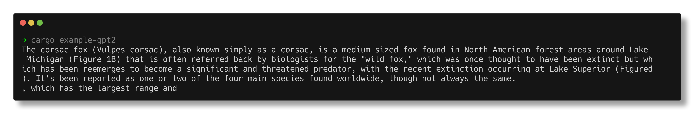
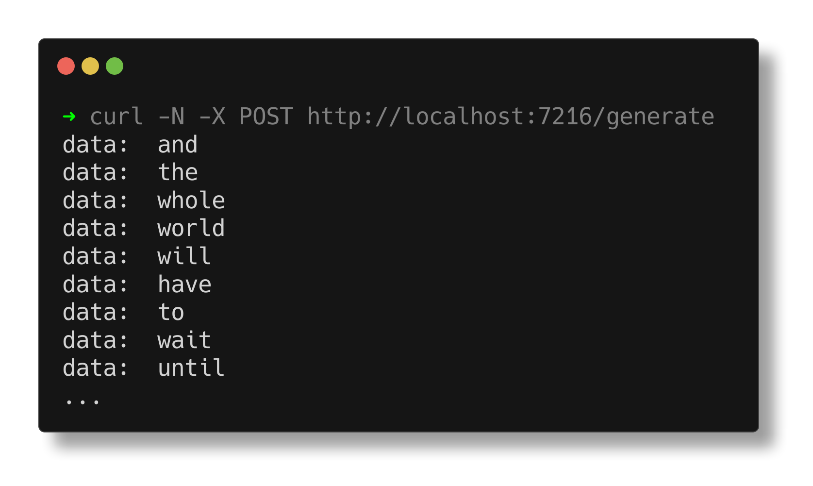
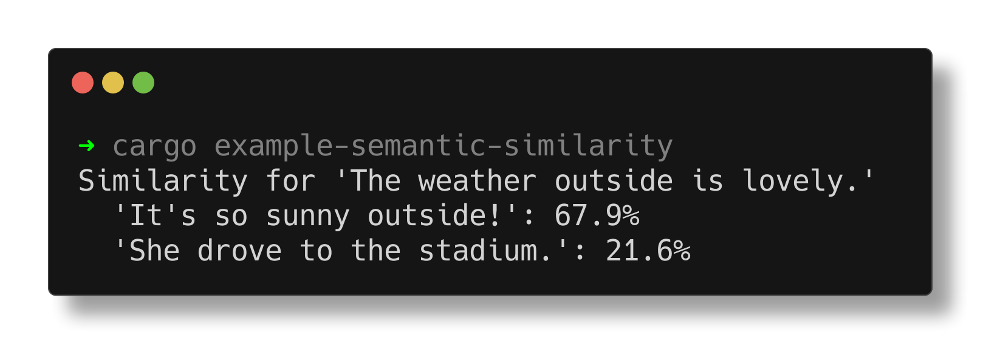
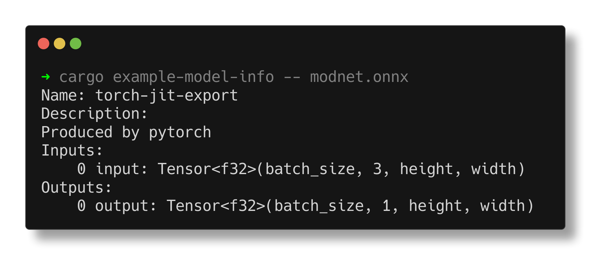
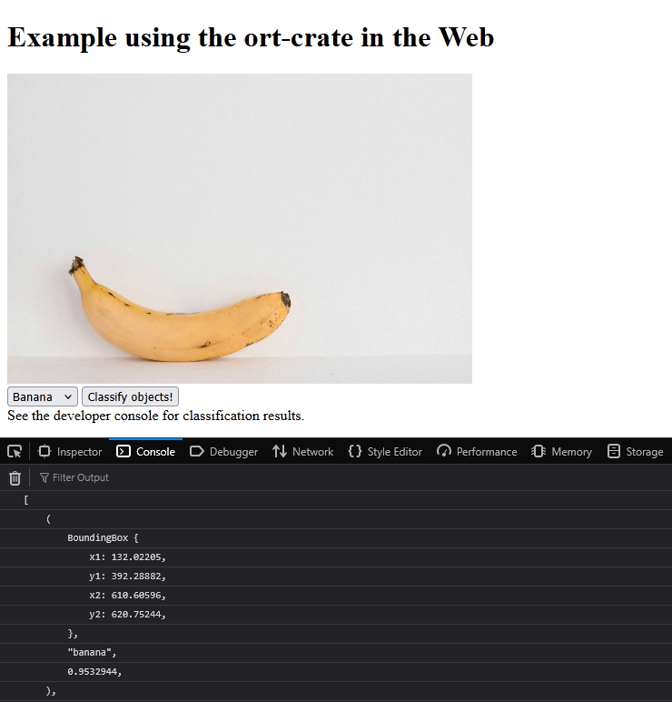

# `ort` examples ✨
- [**`gpt2`**](#gpt2): Classic [GPT-2](https://openai.com/index/better-language-models/) language model text generation
- [**`async-gpt2-api`**](#async-gpt2-api): GPT-2 behind an HTTP API with `Session::run_async` and [`axum`](https://crates.io/crates/axum)
- [**`yolov8`**](#yolov8): [YOLOv8](https://docs.ultralytics.com/models/yolov8/) object detection
- [**`semantic-similarity`**](#semantic-similarity): Semantic textual similarity using [`all-MiniLM-L6-v2`](https://huggingface.co/sentence-transformers/all-MiniLM-L6-v2) from [SentenceTransformers](https://sbert.net/index.html) (SBERT)
- [**`modnet`**](#modnet): [MODNet](https://github.com/ZHKKKe/MODNet) portrait matting
    - [**`cudarc`**](#cudarc): A variant of `modnet` inferring directly from CUDA buffers using the [`cudarc`](https://crates.io/crates/cudarc) crate.
- [**`phi-3-vision`**](#phi-3-vision): Multimodal text generation using Microsoft's [Phi-3 Vision](https://techcommunity.microsoft.com/blog/azure-ai-services-blog/phi-3-vision-%E2%80%93-catalyzing-multimodal-innovation/4170251) model
- [**`model-info`**](#model-info): Simple CLI app to inspect an ONNX model's metadata
- [**`train-clm`**](#train-clm): Trains a causal language model from scratch using `ort`
    - [**`train-clm-simple`**](#train-clm-simple): `train-clm`, but simpler! Uses a 🤗-esque training API.
- [**`custom-ops`**](#custom-ops): Example implementation of custom operator kernels
- [**`wasm-emscripten`**](#wasm-emscripten): `ort` running in the browser

To run an example:
<ol>
<li>

**Clone the repository**:
```shell
$ git clone https://github.com/pykeio/ort
```

To run an example for a specific version, add `--branch`:
```shell
$ git clone https://github.com/pykeio/ort --branch v2.0.0-rc.10
```
</li>
<li>

**Enter the root of the repository**:
```shell
$ cd ort
```
</li>
<li>

**Run the example** with `cargo example-<name>`:
```shell
$ cargo example-gpt2
```
</li>
</ol>

### Log verbosity
Logs are very verbose by default, which can often clutter the output. The verbosity of `ort`'s logging messages can be controlled with the [`RUST_LOG` environment variable](https://docs.rs/tracing-subscriber/latest/tracing_subscriber/filter/struct.EnvFilter.html). To mostly silence `ort`:
```shell
$ RUST_LOG=ort=warn cargo example-gpt2
```

or, with PowerShell on Windows:
```powershell
$env:RUST_LOG = 'ort=warn';
cargo example-gpt2
```

### Execution providers
You can run an example with an execution provider by passing its feature flag:
```shell
$ cargo example-gpt2 --features cuda
```

Note that not all examples support all execution providers.

### Backends
You can also use feature flags to run with different backends:
```shell
$ cargo example-gpt2 --features backend-tract
```

Note that not all examples may be supported by all alternative backends.

---

## `gpt2`
**[🧑‍💻 View source](https://github.com/pykeio/ort/blob/main/examples/gpt2/gpt2.rs) | `examples/gpt2/gpt2.rs`**



> 💡 This example supports all EPs & backends.

OpenAI's infamous [GPT-2](https://openai.com/index/better-language-models/) language model running in `ort`. It uses a very small model and a very simple sampling algorithm, so it's not very impressive (especially not by today's standards), but the simplicity means it's a great learning resource for running other LLMs with `ort`!

## `async-gpt2-api`
**[🧑‍💻 View source](https://github.com/pykeio/ort/blob/main/examples/async-gpt2-api/async-gpt2-api.rs) | `examples/async-gpt2-api/async-gpt2-api.rs`**



> 💡 This example supports all EPs. No alternative backends currently support `Session::run_async`.

Like the `gpt2` example, but it streams text generation over HTTP using the [`axum`](https://crates.io/crates/axum) web server framework. Similar to OpenAI's API, the response is streamed back as [Server-Sent Events](https://developer.mozilla.org/en-US/docs/Web/API/Server-sent_events) (SSE), so they can easily be received from a JavaScript client.

The application creates an HTTP server on port 7216. Send a POST request to `/generate` to start generating!

## `yolov8`
**[🧑‍💻 View source](https://github.com/pykeio/ort/blob/main/examples/yolov8/yolov8.rs) | `examples/yolov8/yolov8.rs`**


> 💡 This example supports all EPs & backends.

This example implements [YOLOv8](https://docs.ultralytics.com/models/yolov8/) object detection using `ort`. It features loading images with the [`image`](https://crates.io/crates/image) crate, converting them to `ort` tensors with [`ndarray`](https://crates.io/crates/ndarray), processing the inferred bounding boxes, and displaying them with [`show-image`](https://crates.io/crates/show-image). YOLO's architecture makes it fairly simple to adapt this example to other YOLO versions, like YOLOv10/11.

## `semantic-similarity`
**[🧑‍💻 View source](https://github.com/pykeio/ort/blob/main/examples/sentence-transformers/semantic-similarity.rs) | `examples/sentence-transformers/semantic-similarity.rs` | 💖 Contributed by [n12n](https://github.com/kn0sys)**



This example uses the versatile [`all-MiniLM-L6-v2`](https://huggingface.co/sentence-transformers/all-MiniLM-L6-v2) sentence embedding model for textual semantic similarity. It encodes some sample sentences and uses cosine similarity to compare them to a query sentence, à la the popular [SentenceTransformers](https://sbert.net/index.html) Python module (aka SBERT).

## `modnet`
**[🧑‍💻 View source](https://github.com/pykeio/ort/blob/main/examples/modnet/modnet.rs) | `examples/modnet/modnet.rs` | 💖 Contributed by [ling jia](https://github.com/GitNiko)**


> 📸 Photo by [Charlotte May](https://www.pexels.com/photo/unrecognizable-asian-woman-with-rucksack-in-town-5965592/)

> 💡 This example supports all EPs & backends.

This example implements the [MODNet](https://arxiv.org/pdf/2011.11961.pdf) model for portrait matting. Though this example uses a static image for simplicity, with `ort` and a hardware-accelerated execution provider, MODNet can be run in real-time! ⚡

## `cudarc`
**[🧑‍💻 View source](https://github.com/pykeio/ort/blob/main/examples/cudarc/cudarc.rs) | `examples/cudarc/cudarc.rs`**

> ⚠️ This example only supports CUDA with the default (ONNX Runtime) backend.

This example is a variant of [`modnet`](#modnet) that loads the image into a CUDA buffer using [`cudarc`](https://crates.io/crates/cudarc), and then creates an `ort` tensor from it. This can be useful for more complex scenarios where you need to perform on-GPU processing before passing data to an `ort` model.

## `phi-3-vision`
**[🧑‍💻 View source](https://github.com/pykeio/ort/blob/main/examples/phi-3-vision/src/main.rs) | `examples/phi-3-vision/src/main.rs` | Contributed by [web3nomad](https://github.com/web3nomad)**

> 💡 This example supports all EPs & backends.

> ℹ️ **This example requires additional setup** before it can be run. See [the example's README](https://github.com/pykeio/ort/blob/main/examples/phi-3-vision/README.md#run-this-example) for more information.

`phi-3-vision` showcases Microsoft's [Phi-3 Vision](https://techcommunity.microsoft.com/blog/azure-ai-services-blog/phi-3-vision-%E2%80%93-catalyzing-multimodal-innovation/4170251) multimodal vision-language model. It first demonstrates text-only input by asking a simple question using only text - then, it asks Phi-3 Vision to interpret [a graph](https://github.com/pykeio/ort/blob/main/examples/phi-3-vision/data/example.jpg). Unlike [`gpt2`](#gpt2), Phi-3 Vision's model accepts token *embeddings* instead of token *IDs*, so two auxiliary models are needed to perform the text and image embeddings.

## `model-info`
**[🧑‍💻 View source](https://github.com/pykeio/ort/blob/main/examples/model-info/model-info.rs) | `examples/model-info/model-info.rs`**



> 💡 This example supports all backends. (And EPs, but those don't really do anything here.)

`model-info` is a simple application that prints a given model's metadata, as well as the shape & type of its inputs & outputs - like a mini, Rust-ified [Netron](https://netron.app/)!

## `train-clm`
**[🧑‍💻 View source](https://github.com/pykeio/ort/blob/main/examples/training/train-clm.rs) | `examples/training/train-clm.rs`**

> 💡 This example supports all EPs with the default (ONNX Runtime) backend.

> ℹ️ For more information, see [the `training` README](https://github.com/pykeio/ort/blob/main/examples/training/README.md).

**`ort` supports training too!** You can use `ort` to train models from scratch, or finetune existing models to create personalized variants - all on-device, no EP needed!

The `train-clm` example trains a causal language model from scratch on [**OshiChats v2**](https://huggingface.co/datasets/pykeio/oshichats-v2), a dataset of live text chat messages collected from various [VTuber](https://en.wikipedia.org/wiki/VTuber) live streams, in order to create perhaps the worst language model ever. For more practical use, the example can be adapted for supervised fine-tuning (SFT) or LoRA finetuning of larger models.

This example uses `ort`'s more advanced `Trainer` API, manually implementing the training loop. There's also the [`train-clm-simple` example](#train-clm-simple), which uses `ort`'s *simple* `Trainer` API — a Hugging Face Trainer-like interface — though at the cost of some flexibility.

## `train-clm-simple`
**[🧑‍💻 View source](https://github.com/pykeio/ort/blob/main/examples/training/train-clm-simple.rs) | `examples/training/train-clm-simple.rs`**

> 💡 This example supports all EPs with the default (ONNX Runtime) backend.

> ℹ️ For more information, see [the `training` README](https://github.com/pykeio/ort/blob/main/examples/training/README.md).

This example is a variant of `train-clm`, but instead of implementing the training loop manually, it simply sets up a dataloader and *lets training rip* with `trainer.run()`!

```rs
trainer.train(
    TrainingArguments::new(dataloader)
        .with_lr(7e-5)
        .with_max_steps(5000)
        .with_ckpt_strategy(CheckpointStrategy::Steps(500))
        .with_callbacks(LoggerCallback::new())
)?
```

## `custom-ops`
**[🧑‍💻 View source](https://github.com/pykeio/ort/blob/main/examples/custom-ops/custom-ops.rs) | `examples/custom-ops/custom-ops.rs`**

> 💡 This example supports all EPs with the default (ONNX Runtime) backend.

You can also implement your own custom ONNX operators with `ort`! This example showcases two simple operator kernel implementations and their usage in sessions with `OperatorDomain`.

## `wasm-emscripten`
**[🧑‍💻 View source](https://github.com/pykeio/ort/blob/main/examples/wasm-emscripten/src/main.rs) | `examples/wasm-emscripten/src/main.rs` | 💖 Contributed by [Raphael Menges](https://github.com/raphaelmenges)**



> ⚠️ This example is tricky to get working. See [the `wasm-emscripten` README](https://github.com/pykeio/ort/blob/main/examples/wasm-emscripten/README.md). When deploying `ort` to the web, we recommend using the `tract` backend instead of the default ONNX Runtime backend when possible - it's *way* easier!

This example runs a simplified version of the [YOLOv8 example](#yolov8) in the browser using the `wasm32-unknown-emscripten` target.
